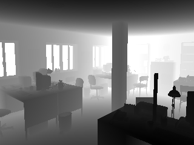
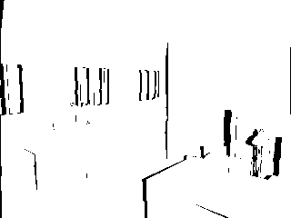

# Project's goals

The goal of this project is to provide an easy-to-install python toolbox that can be used to easily generate synthetic training and testing data for various computer-vision problems such as stereo reconstruction, optical flow, multiview reconstruction, structure from motion, point and segment matching, single view surface normals estimation or shape from shading.

The synthetic images are obtained through the generation of a random 3D scene using  that is rendered using the open-source ray-tracer called povray trough a simple python interface to povray called [vapory](https://github.com/Zulko/vapory).
The povray ray tracer is patched using [vlpovutils](https://github.com/devernay/vlpovutils) to allow the obtention of the disparity map in case of stereo pairs generation. 

Generating synthetic data allows us 

* to have a complete control on the type a scenes we want to specialize our algorithm on, For example we can generate scenes that piecewise planar and that are manahattan or not. We have a control on the surface properties (lambertian  or with specularities) and we can control the amount and type of textures. 

* to generate data in large quantities (assuming you have enough computational ressources) 

* to have perfect ground truth with no measure error, that can be usefull when checking that there are no bugs in your stereo or optical flow code. 

 
## Examples

synthetic stereo pairs
 
left image:

 
 
right image:

left image:

right image:

left ground truth depth:

right ground truth depth:

right ground truth motion field:

left ground truth motion field:

left gocclusions:

right gocclusions:

left disparity obtain from the pair of image and Semi global Patch matching from OpenCV: 

# Limitations

The scenes are generated in the pov-ray format using a constructive solid geometry (CSG) description of the surface i.e. using unions and differences of basic 3D shapes such as sphere cubes etc and thus there is no triangulated surface description of the scene. This can be a problem if one wants to use the triangulated surface to generate disparity maps or displacement fields.
This could be overcome by allowing the user the generate random scene that are triangulated surfaces, either by generating directly triangulated surfaces or by converting the CSG into a triangulated surface before rendering and by giving access to the triangulated surface to the user. 
However  i could not find tool to generate meshes from povrayfile (which would require some solid-geometry-to-mesh tool such as  openSCAD or [solidPython](https://github.com/SolidCode/SolidPython)). 

An approach would consist in using only meshed and no solid geometry , and then use CGAL to generate the depth map using raytracing in CGAL, or use some other renderer that gives access to the zbuffer.
This has the advantage of beeing more flexible that using a pached version of povray and would allow to get disparities in  hidden parts too. 

# References and links

synthetic office and living room images + depth [here](http://www.doc.ic.ac.uk/~ahanda/VaFRIC/iclnuim.html)
the paper describing the image generation process can be found [here](http://www.doc.ic.ac.uk/~ahanda/VaFRIC/icra2014.pdf)
it has been generated wit POVray http://www.povray.org/
improved version of thes synthetic data with additional what can be found [here](http://redwood-data.org/indoor/dataset.html)
explaination on how to create a camera paramterized as usually done in computer vision in povray in [here](http://www.inf.u-szeged.hu/projectdirs/kepaf2011/pdfs/S07_02.pdf)
gettign data from http://robotvault.bitbucket.org/
but there is no texture for now...

# Install

## linux (tested on ubuntu)

in a terminal go in the folder than contains the script install.sh and run it by typing 
	
	./install.sh

after running the script you should have the three executables

	/usr/local/bin/megapov
	/usr/local/bin/motionfield2
	/usr/local/bin/vlpov_project

and a symbolic link 
	/usr/local/bin/povray

## testing 

following the example from [here](http://devernay.free.fr/vision/focus/office/) i'm trying to generate a stereo pair with the corresponding disparity map
we first fetch the data and create folder

	mkdir data
	cd data
	mkdir office
	cd office
	wget http://devernay.free.fr/vision/focus/office/office-focalblur.zip
	unzip -a office-focalblur.zip
	cd office-focalblur
	wget  http://www.ignorancia.org/uploads/zips/office.zip
	unzip -a office.zip
	wget  http://www.ignorancia.org/uploads/zips/lightsys4c.zip
	unzip -a lightsys4c.zip
	wget http://www.ignorancia.org/uploads/zips/bookplacer.zip
	unzip -a bookplacer.zip
	wget http://www.ignorancia.org/uploads/zips/meshlath.zip
	unzip -a meshlath.zip	
	mkdir office-left office-right
	
we render the scene with very low quality in order to quickly get the depth information

	megapov +Q0 -UV +w320 +h240 -A +L. +L./office +L./office/maps +L./LightsysIV +L./office-left +K0.0 +Ioffice_stereo_megapov.pov +Ooffice_stereo1_megapov.png
	megapov +Q0 -UV +w320 +h240 -A +L. +L./office +L./office/maps +L./LightsysIV +L./office-right +K1.0 +Ioffice_stereo_megapov.pov +Ooffice_stereo2_megapov.png

	

this should have create 3 files in each subfolder office-left: office_stereo1_megapov.png,office_stereo1_megapov.txt,office_stereo1_megapov.depth
and three similar files in office-right. I you don't have te txt and depth files generated you may not be calling the patched megapov version (using megapov-annotation-0.2.patch see above).
The depth file containe the distances to the camera for each pixel in a little indian floatting point format. You can visualize the depth map using read_depth.py

 

we can now get the occlusion masks 

	vlpov_motionfield2 office-left/office_stereo1_megapov office-right/office_stereo2_megapov

this creates 3 files 	office_stereo1_megapov.office_stereo2_megapov.occ.tif (occlusion mask), office_stereo1_megapov.office_stereo2_megapov.my.tif (disparity map in direction y, it should be all zeros but i get values of about 0.00001) and office_stereo1_megapov.office_stereo2_megapov.mx.tif (disparity map in direction x ? )
the motion field images are 32bit floating point tif files which cannot be visualize in the default ubuntu image viewer, however you can read ans export them to png images using read_depth.py

occlusion map:

disparity my:

disparity mx:

getting the disparity maps
	
	(echo -100 110 -20; echo 65 289 165) | vlpov_project office-left/office_stereo1_megapov office-right/office_stereo2_megapov

this seems to only print the following information, without file beeing created. Is that information combined with thr motion field enought to create the disparity maps ? 
	159.373 275.731 534.022 0.25369 -1.16108e-05
	161.238 275.731 267.011 -3.47487 1.63918e-06

We can also render the image with better qualities and different focus zones

	megapov +FN16 +Q9 -UV +w320 +h240 -A +L. +L./office +L./office/maps +L./LightsysIV +L./office-left +K0.0 +Ioffice_stereo_far.pov +Ooffice_stereo1_far.png
	megapov +FN16 +Q9 -UV +w320 +h240 -A +L. +L./office +L./office/maps +L./LightsysIV +L./office-left +K0.0 +Ioffice_stereo_near.pov +Ooffice_stereo1_near.png
	megapov +FN16 +Q9 -UV +w320 +h240 -A +L. +L./office +L./office/maps +L./LightsysIV +L./office-left +K0.0 +Ioffice_stereo_near2.pov +Ooffice_stereo1_near2.png
	megapov +FN16 +Q9 -UV +w320 +h240 -A +L. +L./office +L./office/maps +L./LightsysIV +L./office-left +K0.0 +Ioffice_stereo_far2.pov +Ooffice_stereo1_far2.png
	megapov +FN16 +Q9 -UV +w320 +h240 +A0.0 +J0.0 -A +L. +L./office +L./office/maps +L./LightsysIV +L./office-left +K0.0 +Ioffice_stereo.pov +Ooffice_stereo1_all.png
	megapov +FN16 +Q9 -UV +w320 +h240 +L. +L./office +L./office/maps +L./LightsysIV +L./office-right +K1.0 +Ioffice_stereo_far.pov +Ooffice_stereo2_far.png
	megapov +FN16 +Q9 -UV +w320 +h240 +L. +L./office +L./office/maps +L./LightsysIV +L./office-right +K1.0 +Ioffice_stereo_near.pov +Ooffice_stereo2_near.png
	megapov +FN16 +Q9 -UV +w320 +h240 +L. +L./office +L./office/maps +L./LightsysIV +L./office-right +K1.0 +Ioffice_stereo_near2.pov +Ooffice_stereo2_near2.png
	megapov +FN16 +Q9 -UV +w320 +h240 +L. +L./office +L./office/maps +L./LightsysIV +L./office-right +K1.0 +Ioffice_stereo_far2.pov +Ooffice_stereo2_far2.png
	megapov +FN16 +Q9 -UV +w320 +h240 +A0.0 +J0.0 +L. +L./office +L./office/maps +L./LightsysIV +L./office-right +K1.0 +Ioffice_stereo.pov +Ooffice_stereo2_all.png

the rendering at this level of quality is very long to run, about an hour for one image, despite the small resolution.
I have the impression that is is much slower that the precompiled version of povray 3.7 , is it so ? 

megapov +FN16 +Q0 -UV +w320 +h240 -A +L. +L./office +L./office/maps +L./LightsysIV +L./office-left +K0.0 +Ioffice_stereo_far.pov +Ooffice_stereo1_far.png
megapov  +Q0 -UV +w320 +h240 -A +L. +L./office +L./office/maps +L./LightsysIV +L./office-left +K0.0 +Ioffice_stereo_far.pov +Ooffice_stereo1_far.png

#TODO

* modify vapory to use the patched megapov executable (or use the symbolic link trick discussed above) and add the code to read the depth map, disparity maps and occlusion map (read_depth/py) to the vapory code, to make a nice python interface. We need to add a local copy of vapory to the code to do that.

* make a script to make the full installation process easier using pip install. 

* maybe add the code of vapory, megapov and vlpovutils to the repository to make the installation easier ? 

# some models available online

we could enrich our synthetic scene using existing 3D models

archive3D.net archibase.co

website listing most webstite with a short descritpion :
	http://en.wikibooks.org/wiki/Blender_3D:_Noob_to_Pro/Sources_of_free_3D_models

http://www.blender-models.com/
	not many model in total (392items), and very few interesting for us

http://blender-archi.tuxfamily.org/Models#Chair
	quite a few furniture models, no scenes

http://archive3d.net/
	many furniture models , not blender files  no scenes

http://www.blendswap.com/blends/view/67359
	many scenes , can be filtrer by licens (CC-0 ,CC-By, CC-BY-SA) will look what these licences mean
	http://www.blendswap.com/search?term=kitchen		
	www.blendswap.com/search?term=+room

http://sketchup.google.com/3dwarehouse
	quite a few kitchen and living rooms, not really reastic models in general

http://resources.blogscopia.com
 	license : Creative Commons 3.0 Unported ( http://resources.blogscopia.com/license-2/)	
	furnitures but not complete scenes
	exemple
	contemp_living_room_sh3d.zip
	contemp_living_room_obj.zip

