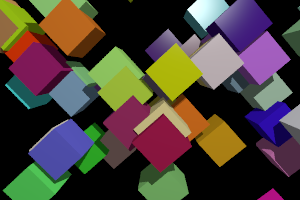
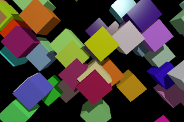
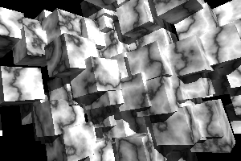
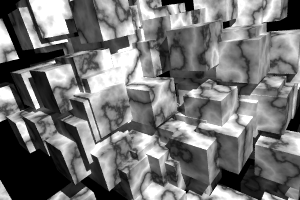
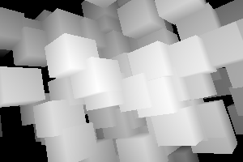
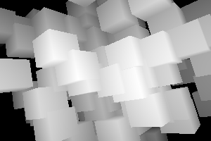
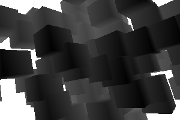
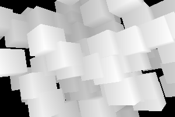
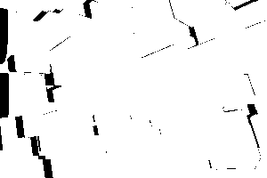
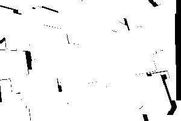

# Project's goals

The goal of this project is to provide an easy-to-install python toolbox that can be used to easily generate synthetic training and testing data for various computer-vision problems such as stereo reconstruction, optical flow, multiview reconstruction, structure from motion, point and segment matching, single view surface normals estimation or shape from shading. For now only rigid scene are handled.

The synthetic images are obtained through the generation of a random 3D scene that is rendered using the open-source ray-tracer called povray trough a simple python interface to povray called [vapory](https://github.com/Zulko/vapory).
The povray ray tracer is patched using [vlpovutils](https://github.com/devernay/vlpovutils) in order to allow the obtention of the disparity map in case of stereo pairs generation. 

Generating synthetic data allows us 

* to have a complete control on the type a scenes we want to specialize our algorithm on, For example we can generate scenes that are piecewise planar and that are manahattan or not. We have a control on the surface properties (lambertian  or with specularities) and we can control the amount and type of textures. 

* to generate data in large quantities (assuming you have enough computational ressources) 

* to have perfect ground truth with no measure error, that can be usefull to check that there are no bugs in your stereo or optical flow code. 

 
## Examples

synthetic stereo pairs

|  left image | right image  |
| ----| ---- |
|    |   |

|  left image | right image  |
| ----| ---- |
|    |   |

|  left ground truth depth  | right ground truth depth  |
| ----| ---- |
|    |   |

| left ground truth motion field |  right ground truth motion field  | 
| ----| ---- |
|    |  |

|  left occlusions  | right occlusions  |
| ----| ---- |
|  |   |

left disparity obtain from the pair of image and Semi global Patch matching from OpenCV: 

# Limitations

The scenes are generated in the pov-ray format using a constructive solid geometry (CSG) description of the surface i.e. using unions and differences of basic 3D shapes such as sphere cubes etc and thus there is no triangulated surface description of the scene. This can be a problem if one wants to use the triangulated surface to generate disparity maps or displacement fields.
This could be overcome by allowing the user the generate random scene that are triangulated surfaces, either by generating directly triangulated surfaces or by converting the CSG into a triangulated surface before rendering and by giving access to the triangulated surface to the user. 
However  i could not find tool to generate meshes from povrayfile (which would require some solid-geometry-to-mesh tool such as  openSCAD or [solidPython](https://github.com/SolidCode/SolidPython)). 

An approach would consist in using only meshed and no solid geometry , and then use CGAL to generate the depth map using raytracing in CGAL, or use some other renderer that gives access to the zbuffer.
This has the advantage of beeing more flexible that using a pached version of povray and would allow to get disparities in  hidden parts too. 

# Install

## linux (tested on ubuntu)

in a terminal clone the repository and move in the folder than contains the installation script 
	hg clone https://martin_delagorce@bitbucket.org/martin_delagorce/syntheticcv
	cd syntheticcv

run the installation script  by typing

	sh install.sh

you should get the executables
	
	./thirdparties/megapov/bin/povray
	./thirdparties/megapov/bin/megapov
	./thirdparties/megapov/bin/vlpov_motionfield2

if you have trouble compiling povray for some png related function, you may want to use to check that the libpng version is 12 on the system. otherwise you can try to use libpbg15 with the patch from vlpovutils

if you get the error  undefined reference to "png_write_finish_row' when compiling povray you can try, once you are in the povray subfolder 

	cp  $PWD/../libpng15/lib/libpng15.so.15 $PWD/../libpng15/lib/libpng12.so
	export CPPFLAGS=-I$PWD/../libpng15/include
	export LDFLAGS=-L$PWD/../libpng15/lib
	./configure --prefix=$PWD/../megapov --with-x COMPILED_BY="martin.de-la-gorce@enpc.fr"  --disable-lib-checks
	make
	make install 

## testing 

run the python script test_vapory.py:

	python test_vapory.py

it will create the images shown in the examples above in a the tmp subfolder

#TODO

* check that the ground truth dispary maps  are correct

* modify vapory or add a layer to use the patched megapov executable (or use the symbolic link trick discussed above) and add the code to read the depth map, disparity maps and occlusion map (read_depth/py) to the vapory code, to make a nice python interface. We need to add a local copy of vapory to the code to do that.

* give a better control of the camera paramters, uncluding the focal. Maybe allows to add distortions in the camera? there are already some non conventional camera models in povray [see here](http://www.povray.org/documentation/view/3.6.1/247/)

* obtain motion field for non rigid scene. It might be quite difficult to do.

# References and links

## synthetic scene rendering

the code use to call from python the generation of the depth map using the patched version of megapov as been inspired from
following the example from [here](http://devernay.free.fr/vision/focus/office/)
 
There are synthetic office and living room images + depth [here](http://www.doc.ic.ac.uk/~ahanda/VaFRIC/iclnuim.html)

the paper describing the image generation process can be found [here](http://www.doc.ic.ac.uk/~ahanda/VaFRIC/icra2014.pdf)
it has been generated wit POVray http://www.povray.org/

improved version of thes synthetic data with additional what can be found [here](http://redwood-data.org/indoor/dataset.html)

explaination on how to create a camera paramterized as usually done in computer vision in povray in [1], but there is not code available online.

there a a similar project to generate synthetic scenes seen from a car [3] 

 
## using blender

An alternative to using povray could be to use blender. 
We could generate random scenes using a python script within python and then render pairs of stereo images using
https://www.blender.org/manual/render/workflows/multiview.html.

Could the whole process be scripted such that it can be launch by a single press button ? could it be run from the command line or does it have to be launched manually from within blender ? 
have a look at https://www.blender.org/manual/game_engine/camera/stereo.html and
http://wiki.blender.org/index.php/User:Dfelinto/Stereoscopy
in order to get the depth images we could use
http://www.cs.tut.fi/kurssit/SGN-5406/vrlab2012/blender-manual.pdf or maybe http://www.blensor.org

How easy would it be to add distortion models to the camera ? 

The data set from the sintel animated movies available [2] has been obtained using a modified version of blender. Could we reuse their scripts and code with our randomly generated scenes ? 
The paper [2] describes the methodology and modications than have been done to blender to generate the data, but it seems that the code has not been made publicly available.

## using maya 

 We coud use the code used to generate synthethic optical flow data used in the paper [4]

# Questions

* Why using random scenes instead of sintel scene (http://sintel.is.tue.mpg.de/stereo)? 

	the sintel movie contains many curvy object and might not be suited to train or test methods that work for man made objects with piecwise planar surfaces like urban scenes. The dataset is also limited. Our goal is not to provide a new dataset but opensource tools to create new ones. We can generate un unlimited amount of data. Using our own random scene, we have a better control on the scene properties, we can control the amount of texture, specularities etc. This comes at the cost of having scene that may not have stastics that are similar to natural images.

* Why not using a blender scripts ?

	that coudl be a good alternative (see section above about blender) using python scripts inside blender, but we may need to  modify blender's C++ source code on order to implement some of the aimed functionalities asdone by [2]

## some models available online

If we want to generate interior scenes we could enrich our synthetic scenes using existing 3D models

* archive3D.net archibase.co

* http://www.blender-models.com/ (not many models in total )

* http://blender-archi.tuxfamily.org/Models#Chair

* http://archive3d.net/ (many furniture models , not blender files  no scenes)

* http://www.blendswap.com/blends/view/67359
	many scenes , can be filtrer by licence (CC-0 ,CC-By, CC-BY-SA) will need to look what these licences mean
	http://www.blendswap.com/search?term=kitchen		
	www.blendswap.com/search?term=+room

*  http://robotvault.bitbucket.org/ (complete indoor scens , but there is no texture for now)

* http://sketchup.google.com/3dwarehouse
	quite a few kitchen and living rooms, not really realistic models in general

* http://resources.blogscopia.com
 	license : Creative Commons 3.0 Unported ( http://resources.blogscopia.com/license-2/)	
	furnitures but not complete scenes
	exemple
	contemp_living_room_sh3d.zip
	contemp_living_room_obj.zip

*	http://en.wikibooks.org/wiki/Blender_3D:_Noob_to_Pro/Sources_of_free_3D_models (website listing most websites that offer 3D models with a short description :)

## references

[1] *High-precision Ground-truth Data for Evaluating Dense Stereo and Optical Flow Algorithms* by Andras Bodis-Szomoru, Tamas Daboczi. 8th Conference of the Hungarian Association for Image Processing and Pattern Recognition (KÉPAF'2011)
[paper](http://www.inf.u-szeged.hu/projectdirs/kepaf2011/pdfs/S07_02.pdf)

[2] *Lessons and Insights from Creating a Synthetic Optical Flow Benchmark* JonasWulff, Daniel J Butler, Garrett B Stanley,  Michael J Black. ECCV Workshop on Unsolved Problems in Optical Flow and Stereo Estimation, Springer-Verlag, Part II, LNCS 7584, pages 168-177, October 2012.
 [paper](http://files.is.tue.mpg.de/black/papers/WulffECCVws2012.pdf) [dataset](http://sintel.is.tue.mpg.de/)

[3] *Framework for generation of synthetic ground truth data for driver assistance applications* Vladimir Haltakov, 
Christian Unger, Slobodan Ilic. Pattern Recognition 2013 [project page](http://campar.in.tum.de/Chair/ProjectSyntheticDataset)
[github page](https://github.com/haltakov/synthetic-dataset)

[4] *Learning a Confidence Measure for Optical Flow* Mac Aodha, O., Humayun, A., Pollefeys, M., Brostow, G.J. PAMI 2012 [paper](https://www.inf.ethz.ch/personal/pomarc/pubs/MacAodhaPAMI12.pdf) [code](http://visual.cs.ucl.ac.uk/pubs/flowConfidence/GetFlowv1.2.zip)

